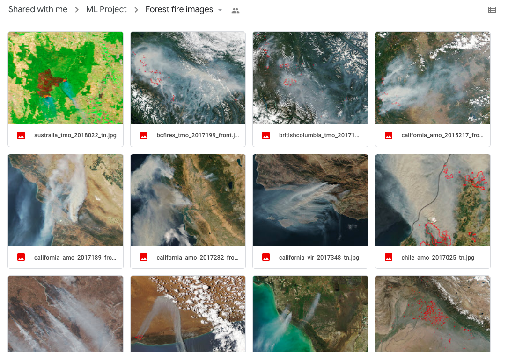
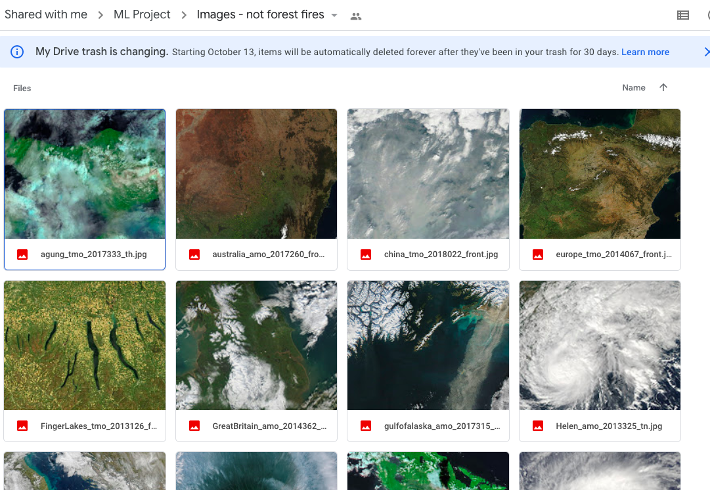
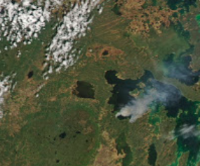
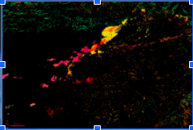
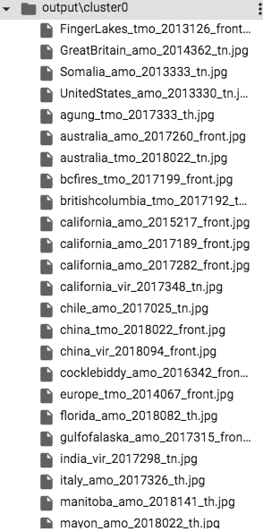
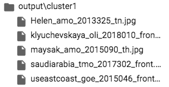
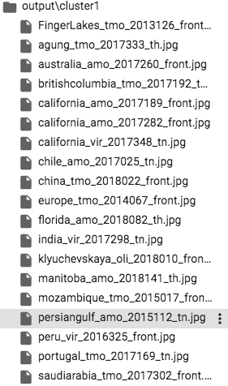
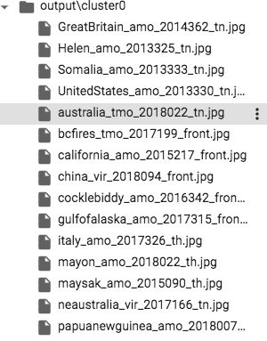

Problem Statement: How do we most accurately model and predict the spread of wildfires in a given region using machine learning techniques?

<a href="page1.md">initial plan</a>

**Introduction:**
There were 50,477 wildfires in 2019 and 58,083 wildfires in 2018, according to the National Interagency Fire Center (NIFC). Around 4.7 million acres were burned in 2019 and  8.8 million acres burned in 2018. Wildfires are of high exigence for the damage they do to wildlife and air quality, and the threat they pose to human lives and nature preservation.

In our project proposal we set out to use NASA data to help in the prediction and analysis of forest fires. For our second touchpoint we will be discussing our unsupervised learning techniques. We implemented two algorithms(expectation–maximization and kmeans) and applied them to the images in order to preprocess and detect the features. Along with clustering them into two groups in order to try and see their accuracy in seperating out images with and without fire. We plan to use the algorithms and results found in the satellite images as a pre-processing step for the supervised portion of our project.

**Methods:**

Inspired by a reading of a 2019 paper on Segmentation of Fire and Smoke from Infra-Red Videos and a 2013 paper on flame segmentation based on flame pixel identification, we wanted to use clustering to find patterns in images to aid in the detection of forest fires. Additionally, we performed segmentation based on smoke pixel identification. Both of these methods on their own fall prone to false positives; we performed segmentation separately considering both with the goal of later combining the segmentation results from both approaches to more fully utilize the potential of satellite imagery in identifying the presence of a wildfire.

**DATA:**

Our input data was a series of labelled images from the NASA MODIS sensor on the Aqua and Terra satellite. We chose these images from satellites since they have a high resolution and can be downloaded in the form of RBG Jpegs. This made them ideal for the kind of image analysis we wanted to perform on them. The images ranged from featuring fires and/or smoke to regular satellite images that did not include any kind of fire-related natural disasters. 



**PROCESS:**
In order to be able to feed the images through the algorithms, we needed to reduce the images into numbers.To start we standardized the images so that they were all the same size and then selected a portion of images from our dataset to run our unsupervised learning algorithms. We didn't use all of the data set in order to save computation power.

We then used EM and Kmeans to segment the colors in our images, firstly trying to cluster by warm tones featured in fires, but also by the color of smoke that differentiates it from fog, clouds, sandstorms, or terrain which might have a gray hue as well.

**ORIGINAL:(manitoba)**

 

**AFTER: (applied EM)** 


**After Applying two different techniques of Kmeans**

1[Image](kmeans3_after.PNG)


In our first attempt to apply Kmeans to our images we used the pixel colors as our features. As a result, when we clustered the images into two clusters (to simulate the binary fire vs not fire classifcation) we got two unequal clusters that were worse than just randomly assigning half the data into one cluster and the other half into another. 
```sil = []
kl = []
kmax = 10

for k in range(2, kmax+1):
  kmeans2 = KMeans(n_clusters = k).fit(pred_images)
  labels = kmeans2.labels_
  sil.append(silhouette_score(pred_images, labels, metric = 'euclidean'))
  kl.append(k)
  
  k = 2
kmodel = KMeans(n_clusters=k, n_jobs=-1, random_state=728)
kmodel.fit(pred_images)
kpredictions = kmodel.predict(pred_images)
for i in range(k):
	os.makedirs("output\cluster" + str(i))
for i in range(len(kpredictions)):
  if i < len(paths_1):
    shutil.copy2(paths_1[i], "output\cluster"+str(kpredictions[i]))
  else:
    shutil.copy2(paths_2[i%len(paths_1)], "output\cluster"+str(kpredictions[i]))
```



After adding in some code for feature detection we got slighly better results, but the clustering was still about as good as random. 
```model = tf.keras.applications.MobileNetV2(include_top=False, weights="imagenet", input_shape=(224, 224, 3))
predictions = model.predict(images.reshape(-1, 224, 224, 3))
pred_images = predictions.reshape(images.shape[0], -1)
```

Then, after pre-processing the images by segmenting them out with Expectation Maximum we got clustering results that were better than average.
Where, out of the 15 images, only 5 were clustered incorrectly in Cluster 0. And in Cluster 1, out of the 23 images, 9 were clustered incorrectly. Whereas in the previous classifications, in the 21 images 10 were clustered incorrectly. On average, it appears like applying the EM segmentation increased the accuracy by around 33%. 


```emImages = []

for image in images1:
  (H, W, N) = image.shape
  data = image.reshape((H * W, N))
  data_centers = np.mean(data, 0)
  data_scale = np.std(data, 0)
  data = pre.scale(data)
  theImage = EM(data, sunset_, W, H, data_centers, data_scale)
  emImages.append(theImage)
```




**Discussion/ Challenges**
As we have not yet started the supervised stage of our project, our main challenge has been to get the images clustered in a way that makes classifying them as either photos of forest fires or not the easiest it can be. In addition, trying to process and find smoke in images proved to be somewhat difficult and error prone. Another somewhat less pressing issue is the difference between forest fires and other natural phenomenon such as volcanic eruptions, or intentional burning practices. A problem to consider going forward will also be combining the segmentation results from the smoke and fire detection methods in a way that is effective for supervised learning.

As you can see, here are some of the examples of clustering algorithms we have run on our NASA satellite images.

We hope that the visual differences and contrast between elements that could reasonably be fire or smoke and other elements in the images will help us to classify the images with a boolean output in the supervised learning portion of our project, which we are hoping to do using a neural net.

