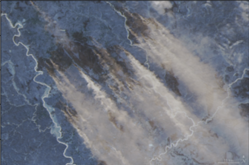
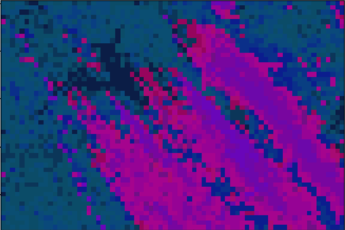
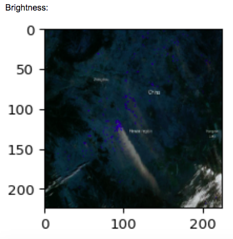
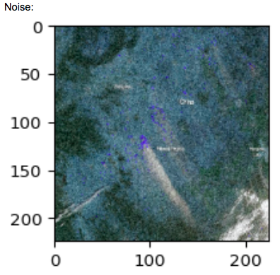
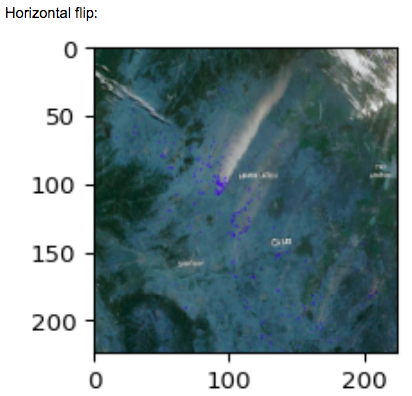
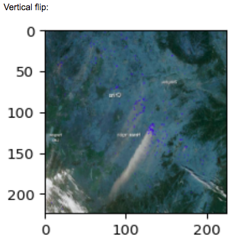
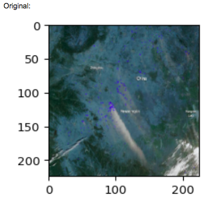
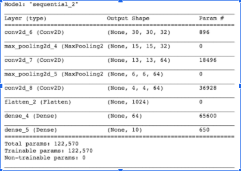
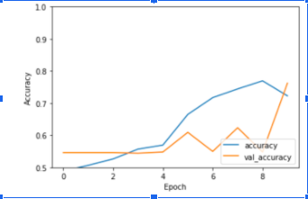

Problem Statement: How do we most accurately model and predict the spread of wildfires in a given region using machine learning techniques?

<a href="page1.md">initial plan</a>

**Introduction:**
There were 50,477 wildfires in 2019 and 58,083 wildfires in 2018, according to the National Interagency Fire Center (NIFC). Around 4.7 million acres were burned in 2019 and  8.8 million acres burned in 2018. Wildfires are of high exigence for the damage they do to wildlife and air quality, and the threat they pose to human lives and nature preservation.

In our project proposal we set out to use NASA data to help in the prediction and analysis of forest fires. During this project we implemented three algorithms. We implemented expectation–maximization and kmeans to the images in order to preprocess and detect the features for the unsupervised portion of the project. For the third supervised portion we implemented a CNN along with data augmentation. 

****Unsupervised Portion****


**Methods:**

Inspired by a reading of a 2019 paper on Segmentation of Fire and Smoke from Infra-Red Videos and a 2013 paper on flame segmentation based on flame pixel identification, we wanted to use clustering to find patterns in images to aid in the detection of forest fires. Additionally, we performed segmentation based on smoke pixel identification. Both of these methods on their own fall prone to false positives; we performed segmentation separately considering both with the goal of later combining the segmentation results from both approaches to more fully utilize the potential of satellite imagery in identifying the presence of a wildfire.

**DATA:**

Our input data was a series of labelled images from the NASA MODIS sensor on the Aqua and Terra satellite. We chose these images from satellites since they have a high resolution and can be downloaded in the form of RBG Jpegs. This made them ideal for the kind of image analysis we wanted to perform on them. The images ranged from featuring fires and/or smoke to regular satellite images that did not include any kind of fire-related natural disasters. 


**PROCESS:**
In order to be able to feed the images through the algorithms, we needed to reduce the images into numbers.To start we standardized the images so that they were all the same size and then selected a portion of images from our dataset to run our unsupervised learning algorithms. We didn't use all of the data set in order to save computation power.

We then used EM and Kmeans to segment the colors in our images, firstly trying to cluster by warm tones featured in fires, but also by the color of smoke that differentiates it from fog, clouds, sandstorms, or terrain which might have a gray hue as well.

**ORIGINAL:(manitoba)**

 

**AFTER: (applied EM)** 


**ORIGINAL:(china)**



**AFTER: (kmeans segmentation to find smoke)**



**After Applying two different techniques of Kmeans **


In our first attempt to apply Kmeans to our images we used the pixel colors as our features. As a result, when we clustered the images into two clusters (to simulate the binary fire vs not fire classifcation) we got two unequal clusters that were worse than just randomly assigning half the data into one cluster and the other half into another. 
```sil = []
kl = []
kmax = 10

for k in range(2, kmax+1):
  kmeans2 = KMeans(n_clusters = k).fit(pred_images)
  labels = kmeans2.labels_
  sil.append(silhouette_score(pred_images, labels, metric = 'euclidean'))
  kl.append(k)
  
  k = 2
kmodel = KMeans(n_clusters=k, n_jobs=-1, random_state=728)
kmodel.fit(pred_images)
kpredictions = kmodel.predict(pred_images)
for i in range(k):
	os.makedirs("output\cluster" + str(i))
for i in range(len(kpredictions)):
  if i < len(paths_1):
    shutil.copy2(paths_1[i], "output\cluster"+str(kpredictions[i]))
  else:
    shutil.copy2(paths_2[i%len(paths_1)], "output\cluster"+str(kpredictions[i]))
```


After adding in some code for feature detection we got slighly better results, but the clustering was still about as good as random. 
```model = tf.keras.applications.MobileNetV2(include_top=False, weights="imagenet", input_shape=(224, 224, 3))
predictions = model.predict(images.reshape(-1, 224, 224, 3))
pred_images = predictions.reshape(images.shape[0], -1)
```

Then, after pre-processing the images by segmenting them out with Expectation Maximum we got clustering results that were better than average.
Where, out of the 15 images, only 5 were clustered incorrectly in Cluster 0. And in Cluster 1, out of the 23 images, 9 were clustered incorrectly. Whereas in the previous classifications, in the 21 images 10 were clustered incorrectly. On average, it appears like applying the EM segmentation increased the accuracy by around 33%. 


```emImages = []

for image in images1:
  (H, W, N) = image.shape
  data = image.reshape((H * W, N))
  data_centers = np.mean(data, 0)
  data_scale = np.std(data, 0)
  data = pre.scale(data)
  theImage = EM(data, sunset_, W, H, data_centers, data_scale)
  emImages.append(theImage)
```


**Discussion/ Challenges**
Our main challenge for this portion was getting the images clustered in a way that makes classifying them as either photos of forest fires or not the easiest it can be. In addition, trying to process and find smoke in images proved to be somewhat difficult and error prone. Another somewhat less pressing issue is the difference between forest fires and other natural phenomenon such as volcanic eruptions, or intentional burning practices. A problem to consider going forward will also be combining the segmentation results from the smoke and fire detection methods in a way that is effective for supervised learning.


****Supervised Portion****


**Methods:**
Working off of Zhang et al and Toni et al’s papers on machine learning in wildfire detection, we used Tensorflow to implement our CNN. We scraped 202 images from the NASA MODIS sensor on the Aqua and Terra satellite, labelled them as having wildfires or not for classification purposes, and mounted them to our Colab notebook to use in our CNN. Our convolutional base is a stack of Convolutional 2D layers and MaxPooling2D layers, and we added several dense layers on top. We got peak accuracy with these layers at 76.216% accuracy with this configuration.  Our training dataset is built off of only 202 satellite images, so we find this accuracy to be somewhat encouraging even though it is not comprehensive for the dataset we hoped to train on. 
In order to train a CNN that worked specifically on satellite images, we used the data augmentation techniques of horizontal and vertical flipping, rotating, cropping, adding Gaussian noise, and adjusting brightness. This augmented our base imageset by a factor of 6. 






 
**Results:**
We were able to achieve a 76.216% accuracy with our hyperparameter tuning, layer configuration, and data augmentation. As we trained on a base dataset including only 100 images in each category of wildfire and non-wildfire images, we feel these results are quite impressive for such a small training set. In addition, we were able to accomplish a 6% increase in accuracy simply through our data augmentation. We feel this is significant and speaks to the strength of our model’s architecture and the techniques used, despite not reaching our original goal accuracy of 80%. 





 
**Discussion:**
Our largest hurdle in the supervised portion of this project was data collection. We quickly realized we would need many more images than we had collected in order to successfully train our model.  We explored a variety of techniques for data collection, including researching open source image databases for use in computer vision projects, CIFAR10 style data libraries, and manually web scraping the images we wanted ourselves. However, we still struggled to collect enough high-quality data to result in high accuracies.
 
We specifically wanted to train a CNN for satellite images, so this also made our data collection more difficult, as data sources are limited and often have these images in difficult formats. The NASA website layout also made image scraping more difficult than traditional web-scraping methods (like for example, downloading a thousand images of lilies off of Google images). 
 
As there are many neural networks that are trained to detect fires in images with high accuracy, we hope that our satellite image specific model will add something a little unique to these efforts, and we will also be publishing our training and testing image sets on our public git repository for future work on this topic, as collecting our dataset was a significant portion of this battle. 
 
Data augmentation did, however, significantly aid in the expansion of our dataset and significantly increased the model’s accuracy. As our dataset was already so small, we were never able to surpass 80% accuracy, as we hoped to be able to do with a balanced two-category classification problem, however, our methods did significantly increase the accuracy of the model, and with more time, we are confident we would have been able to achieve higher accuracies by adding new novel data, and applying our data augmentation techniques to this data.
 
https://www.mdpi.com/2076-3263/10/3/105/pdf
 https://link.springer.com/article/10.1007/s13753-019-00233-1 


