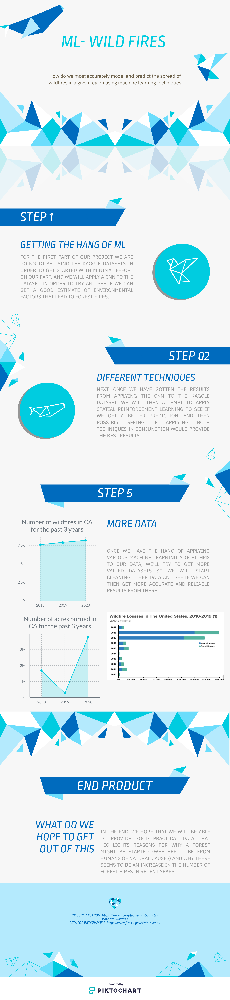

Problem Statement: How do we most accurately model and predict the spread of wildfires in a given region using machine learning techniques?

<a href="page1.html">Midterm Report</a>

Data Sources: NASA Wildfire Data, UCI Forest Fire Data, Kaggle Forest Fire and Wildfire Data
Data: 
UCI Forest Fire dataset: https://archive.ics.uci.edu/ml/datasets/Forest+Fires

Kaggle datasets: https://www.kaggle.com/elikplim/forest-fires-data-set
		    https://www.kaggle.com/rtatman/188-million-us-wildfires

NASA has data: https://earthdata.nasa.gov/learn/toolkits/wildfires

Proposed Approaches: Convolutional Neural Networks, Spatial Reinforcement Learning

A Machine Learning-Based Approach for Wildfire Susceptibility Mapping. The Case Study of the Liguria Region in Italy 
Deals with using ML to predict land cover/vegetation and model wildfires based on what the land is like

Forest Fire Susceptibility Modeling Using a Convolutional Neural Network for Yunnan Province of China
Basically asserts that CNNs are more accurate than random forests (used above)
https://link.springer.com/article/10.1007/s13753-019-00233-1

Using Spatial Reinforcement Learning to Build Forest Wildfire Dynamics Models From Satellite Images
https://www.frontiersin.org/articles/10.3389/fict.2018.00006/full

For more details see [GitHub Flavored Markdown](https://guides.github.com/features/mastering-markdown/).

You can use the [editor on GitHub](https://github.com/Crystal-Shouqi-Li/cs4641_wildfires/edit/gh-pages/index.md) to maintain and preview the content for your website in Markdown files.

Whenever you commit to this repository, GitHub Pages will run [Jekyll](https://jekyllrb.com/) to rebuild the pages in your site, from the content in your Markdown files.

### Jekyll Themes

### Support or Contact

Having trouble with Pages? Check out our [documentation](https://docs.github.com/categories/github-pages-basics/) or [contact support](https://github.com/contact) and we’ll help you sort it out.

